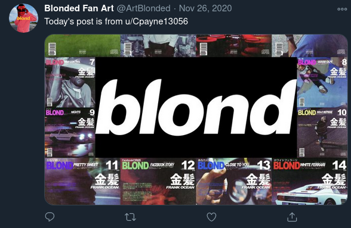
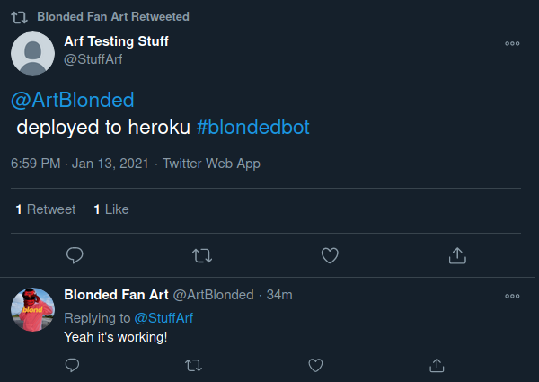

# Frank Ocean Twitter Bot

A little winter break project I did to appreciate one of my favorite musicians :)

## What it does

I made the bot with two primary functionalities:
<li>
  <ul>responding to people's questions - really it only answerws the question of "does it work"
    
    
  </ul>
  <ul>posting once everyday
    
    
  </ul>
</li>

## How it works
There is a worker python script that is essentially always runs, looking for a tweet to reply to, if it finds something to respond to, it will collect the top post from reddit and post it (and the associated user with the reddit post). The program is hosted on Heroku - which setting up was arguably the hardest part of the project.
